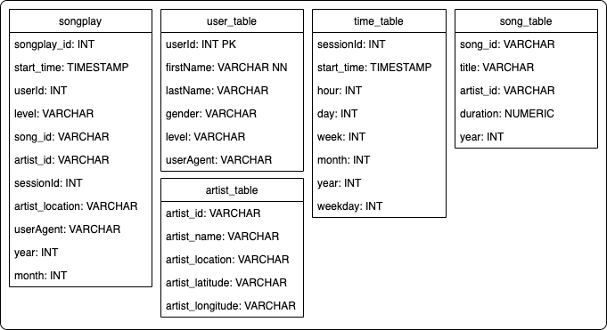

# Project5 - Data Lake
####  A project from Udacity's Data Engineering course
The code was written along the lines of the default Jupyter notebook workspace provided by Udacity.

Author: [Davidson de Faria](https://github.com/davidsondefaria)

## Introduction
The goal of this project is apply what I learned about Spark and Data Lakes to build an ETL pipeline for a data lake hosted on S3.

To execute the project, it was necessary to load data from S3, process the data into analytic tables using Spark, and load it again into S3.

## Code and Data Structure
The tables were created as shown in the figure:

Raw data is loaded from S3 to Pyspark Dataframe where it is transformed to table format for analysis. They are then loaded back into the S3 in Parquet format.

The reason why using Parquet format is that Spark is faster than text, file compression is easier, less disk IO and less CPU usage.

To access S3, you must use the key and security secret created on the AWS IAM user. This set should not be exposed anywhere to cause undue charges.

### ETL Process

The process of extracting, transforming, and loading data occurs in the ETL.py file. The process is performed through the functions:
- The *main* function is responsible for creating the Spark session, setting the path variables for Udacity's S3 input and my S3 output, and calling the functions for music and log processing.
- The *process_song_data(spark, input_data, output_data)* function is responsible to load song data from Udacity's S3 and transform into song and artist tables.
- The *process_log_data(spark, input_data, output_data)* function is responsible to load log data from Udacity's S3, transform into user and time table and joining them with song and artist tables to form the songplay table.
- The ETL process uses the *songSchema* and *logSchema* functions of *schema.py* file to create and adjust the data in tables according to their respective types.